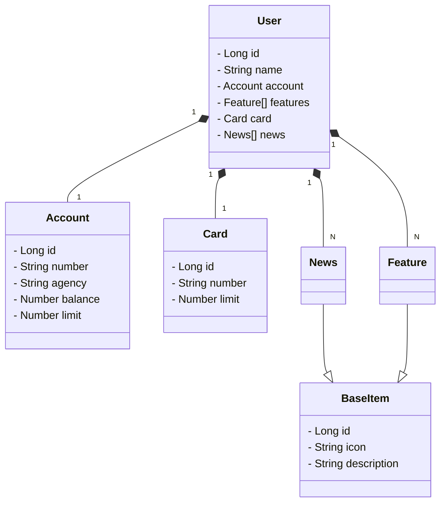

# CRUD conta bancária

Java RESTful API
## Principais Tecnologias
- **Java 17**: Utilizaremos a versão LTS mais recente do Java para tirar vantagem das últimas inovações que essa linguagem robusta e amplamente utilizada oferece;
- **Spring Boot 3**: Trabalharemos com a mais nova versão do Spring Boot, que maximiza a produtividade do desenvolvedor por meio de sua poderosa premissa de autoconfiguração;
- **Spring Data JPA**: Exploraremos como essa ferramenta pode simplificar nossa camada de acesso aos dados, facilitando a integração com bancos de dados SQL;
- **OpenAPI (Swagger)**: Vamos criar uma documentação de API eficaz e fácil de entender usando a OpenAPI (Swagger), perfeitamente alinhada com a alta produtividade que o Spring Boot oferece;
- **Railway**: facilita o deploy e monitoramento de nossas soluções na nuvem, além de oferecer diversos bancos de dados como serviço e pipelines de CI/CD.

## [Link do Figma](https://www.figma.com/file/0ZsjwjsYlYd3timxqMWlbj/SANTANDER---Projeto-Web%2FMobile?type=design&node-id=1421%3A432&mode=design&t=6dPQuerScEQH0zAn-1)

O Figma foi utilizado para a abstração do domínio desta API, sendo útil na análise e projeto da solução.

## Diagrama de Classes (Domínio da API)



## Configuração de Perfis (Profiles)
O Spring Boot permite configurar diferentes perfis de execução para a aplicação. Utilizamos dois arquivos de configuração:

- **`application-dev.yml`**: Contém configurações para o ambiente de desenvolvimento, utilizando o banco de dados H2.
- **`application-prd.yml`**: Contém configurações para o ambiente de produção, utilizando PostgreSQL.

Para definir qual perfil deve ser usado ao rodar a aplicação, é necessário configurar a variável de ambiente `SPRING_PROFILES_ACTIVE`. 

Isso pode ser feito no "Edit Configurations" da IDE:


Adicionando a seguinte configuração em "Environment Variables":


```
SPRING_PROFILES_ACTIVE=dev
```

Com essa configuração, a aplicação rodará em modo de desenvolvimento (`dev`). Para rodar em produção, basta alterar para `SPRING_PROFILES_ACTIVE=prd`.

criar o banco postgres


Usar as variaveis de ambiente pro arquivo yml ed produção


```
# Essas configurações são usadas em produção com PostgreSQL
spring:
  datasource:
    url: jdbc:postgresql://${PGHOST}:${PGPORT}/${PGDATABASE} # URL de conexão com o banco PostgreSQL
    username: ${PGUSER} # Nome de usuário do banco de dados
    password: ${PGPASSWORD} # Senha do banco de dados
  jpa:
    open-in-view: false # Desativa o "Open Session in View" para melhorar o desempenho
    hibernate:
      ddl-auto: create # cria as tabelas ao rodar

```
é preciso criar um novo perfil para produção, assim como o perfil de dev
as variaveis de ambiente (exemplo: ${PGUSER}) tme que ser configuradas com as informações do banco criado


depois de rodar pela primeira vez e criar as tabelas deve trocar o  ddl-auto para n criar de novo as tabelas todas as vezers
```
      ddl-auto: validate # Valida o esquema do banco de dados sem modificá-lo

```
essa configuração de servidor é feito aqui https://web.dio.me/lab/publicando-sua-api-rest-na-nuvem-usando-spring-boot-3-java-17-e-railway/learning/4dc5ad1f-6d76-4acf-8428-3db18d2d28e1

