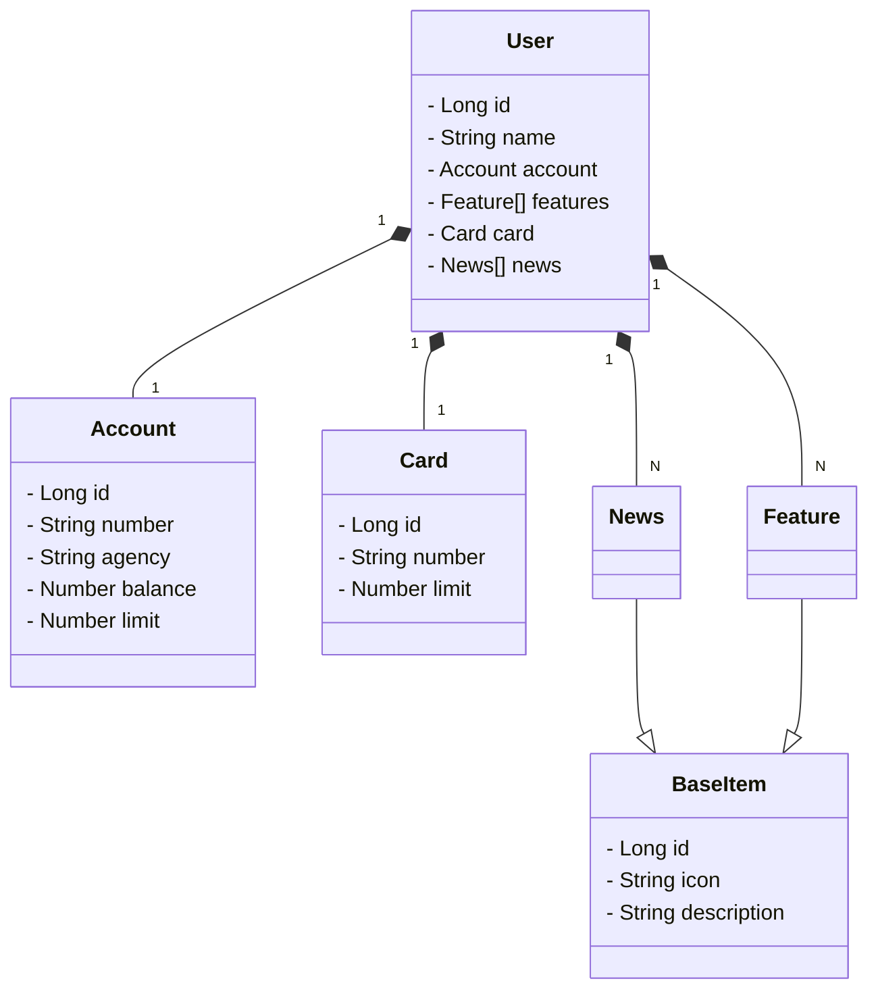

# CRUD conta bancária

Java RESTful API
## Principais Tecnologias
- **Java 17**: Utilizaremos a versão LTS mais recente do Java para tirar vantagem das últimas inovações que essa linguagem robusta e amplamente utilizada oferece;
- **Spring Boot 3**: Trabalharemos com a mais nova versão do Spring Boot, que maximiza a produtividade do desenvolvedor por meio de sua poderosa premissa de autoconfiguração;
- **Spring Data JPA**: Exploraremos como essa ferramenta pode simplificar nossa camada de acesso aos dados, facilitando a integração com bancos de dados SQL;
- **OpenAPI (Swagger)**: Vamos criar uma documentação de API eficaz e fácil de entender usando a OpenAPI (Swagger), perfeitamente alinhada com a alta produtividade que o Spring Boot oferece;
- **Railway**: facilita o deploy e monitoramento de nossas soluções na nuvem, além de oferecer diversos bancos de dados como serviço e pipelines de CI/CD.

## [Link do Figma](https://www.figma.com/file/0ZsjwjsYlYd3timxqMWlbj/SANTANDER---Projeto-Web%2FMobile?type=design&node-id=1421%3A432&mode=design&t=6dPQuerScEQH0zAn-1)

O Figma foi utilizado para a abstração do domínio desta API, sendo útil na análise e projeto da solução.

## Diagrama de Classes (Domínio da API)



## Configuração de Perfis (Profiles)
O Spring Boot permite configurar diferentes perfis de execução para a aplicação. Utilizamos dois arquivos de configuração:

- **`application-dev.yml`**: Contém configurações para o ambiente de desenvolvimento, utilizando o banco de dados H2.
- **`application-prd.yml`**: Contém configurações para o ambiente de produção, utilizando PostgreSQL.

Para definir qual perfil deve ser usado ao rodar a aplicação, é necessário configurar a variável de ambiente `SPRING_PROFILES_ACTIVE`. 

Isso pode ser feito no "Edit Configurations" da IDE:


Adicionando a seguinte configuração em "Environment Variables":


```
SPRING_PROFILES_ACTIVE=dev
```

Com essa configuração, a aplicação rodará em modo de desenvolvimento (`dev`). 

## Estrutura da Aplicação: Model, Service, Controller

- **Model**: Representa a estrutura do banco de dados e define como os dados serão armazenados e recuperados. Cada entidade mapeia uma tabela no banco de dados.
  
- **Service**: A camada de serviço contém a lógica de negócios. Ela é responsável por orquestrar as operações necessárias entre o controlador (Controller) e o repositório (Repository).
  
- **Controller**: O controlador é responsável por expor os endpoints da API. Ele gerencia as requisições e interage com a camada de serviço para fornecer a resposta adequada.

## Dependências do Projeto

Foi criado com as seguintes dependências usando o Spring Initializr:

- **Spring Data JPA**: Para persistência de dados.
- **PostgreSQL**: Banco de dados relacional utilizado para armazenar as informações.
- **Spring Web**: Para criar a API RESTful.
- **Lombok**: Para reduzir a verbosidade do código.
- **Spring DevTools**: Para acelerar o desenvolvimento com reinicialização automática.
- **H2 Database**: Para desenvolvimento local, quando necessário.

[Link do Spring Initializr](https://start.spring.io/#!type=maven-project&language=java&platformVersion=3.4.4&packaging=jar&jvmVersion=17&groupId=com.my&artifactId=santander-bank&name=santander-bank&description=&packageName=com.my.santander-bank&dependencies=data-jpa,postgresql,web,lombok,devtools,h2)

## Acesso ao Banco de Dados

Para acessar o banco de dados H2 local, utilize o seguinte URL:

- **URL do console do H2**: [http://localhost:8080/h2-console/](http://localhost:8080/h2-console/)

## Documentação da API (Swagger)

Para documentar a API, foi adicionada a dependência do Swagger no arquivo `pom.xml`:

```xml
<dependency>
    <groupId>org.springdoc</groupId>
    <artifactId>springdoc-openapi-starter-webmvc-ui</artifactId>
    <version>2.2.0</version>
</dependency>
```

A documentação gerada pode ser acessada no seguinte URL:

- **Swagger UI**: [http://localhost:8080/swagger-ui/index.html](http://localhost:8080/swagger-ui/index.html)

## Deploy

O deploy foi feito usando a plataforma **Railway**:

- [Railway](https://railway.com/)

### Configuração de Banco de Dados PostgreSQL para Produção

### Passos para Criar o Banco no PostgreSQL

1. Criar o banco de dados PostgreSQL.

   

2. Configurar variáveis de ambiente no arquivo `application-prd.yml`.

   Adicione as variáveis de ambiente para o arquivo de configuração de produção. Exemplo:
   
   

```yaml
# Essas configurações são usadas em produção com PostgreSQL
spring:
  datasource:
    url: jdbc:postgresql://${PGHOST}:${PGPORT}/${PGDATABASE} # URL de conexão com o banco PostgreSQL
    username: ${PGUSER} # Nome de usuário do banco de dados
    password: ${PGPASSWORD} # Senha do banco de dados
  jpa:
    open-in-view: false # Desativa o "Open Session in View" para melhorar o desempenho
    hibernate:
      ddl-auto: create # Cria as tabelas ao rodar pela primeira vez
```

3. É necessário configurar as variáveis de ambiente, como `${PGUSER}`, com as informações do banco criado.

   

### Alteração Após Primeira Execução

Após a primeira execução, onde as tabelas são criadas automaticamente, altere a configuração `ddl-auto` para evitar que as tabelas sejam recriadas a cada execução.

```yaml
spring:
  jpa:
    hibernate:
      ddl-auto: validate # Valida o esquema do banco de dados sem modificá-lo
```

## Configuração de Servidor

Para realizar o deploy da aplicação na nuvem utilizando Railway, siga o tutorial descrito [aqui](https://web.dio.me/lab/publicando-sua-api-rest-na-nuvem-usando-spring-boot-3-java-17-e-railway/learning/4dc5ad1f-6d76-4acf-8428-3db18d2d28e1).
```

---

